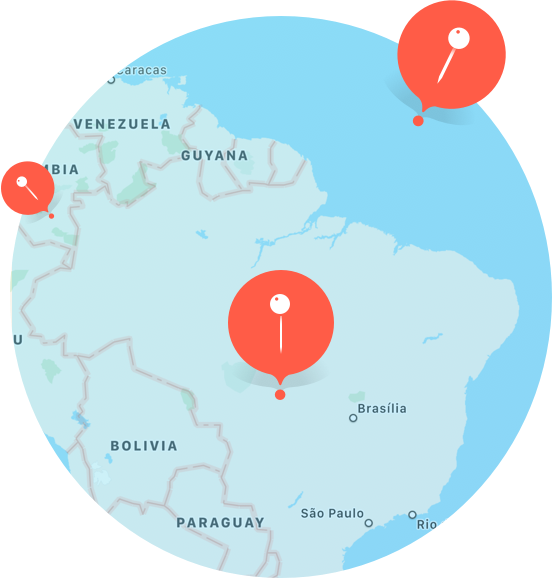
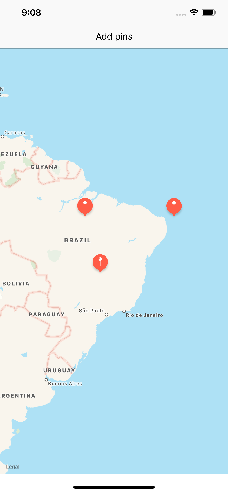
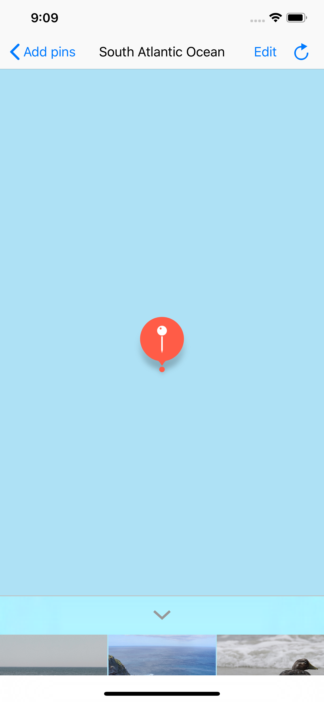
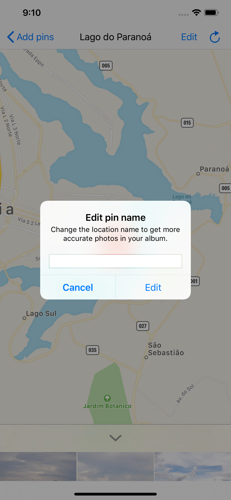

# Virtual Tourist

An app that lets its users keep and check multiple photo albums associated with the entered locations.
This is also the project solution to the second assignment of the iOS Developer nanodegree from Udacity.

## App images

## Requirements to run this app

### Versions:
- Xcode 10+
- Swift 4+
### Flickr API:
This app uses the Flickr API to get the photos associated to an specific location. In order to use this app, you'll have to provide your own Flickr API key. To configure it, you'll need to add a new file called <strong>keys.xcconfig</strong>, inside the <strong>Supporting Files/Secrets/</strong> folder.

Inside this file you can place your api key like this: <code>FLICKR_API_KEY = YOUR_API_KEY_HERE</code>. There's also a keys.example.xcconfig file you can use to copy this simple configuration.
